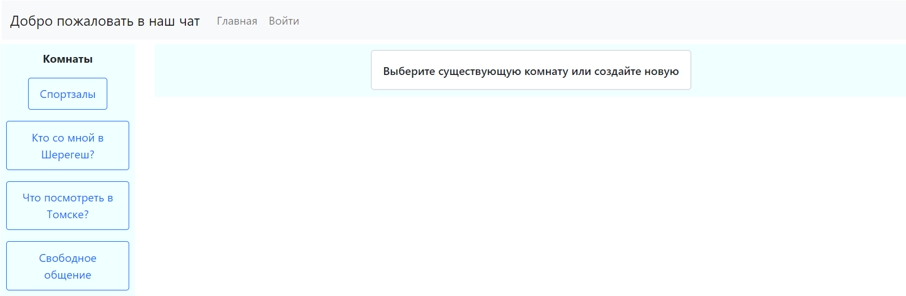

# job4j_chat

Чат основанный на Spring Boot и REST API.

Незарегистрированные пользователи могут просматривать комнаты и сообщения.

Зарегистрированные пользователи могут создавть комнаты и оставлять сообщения во всех комнатах.

Есть возможность удаления комнат, редактирования названий комнат и удаления сообщений.

Главная страница.

Создание комнаты.

Страница комнаты.

Ошибка удаления сообщения пользователем, не являющимся администратором или владельцем комнаты.

Переименование комнаты.

Ошибка отправки сообщения незарегистрированным пользователем.

Ошибка удаления сообщения пользователем, не являющимся администратором или автором сообщения.

Страница регистрации.

Страница входа после успешной регистрации.

