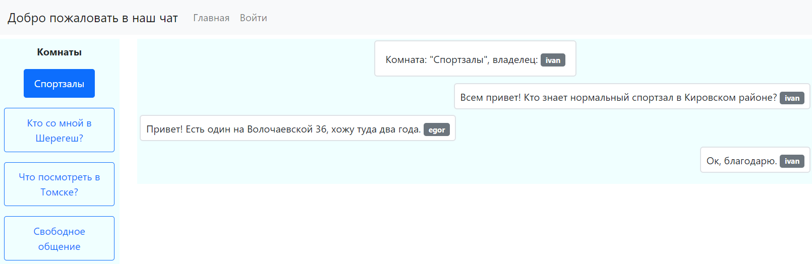
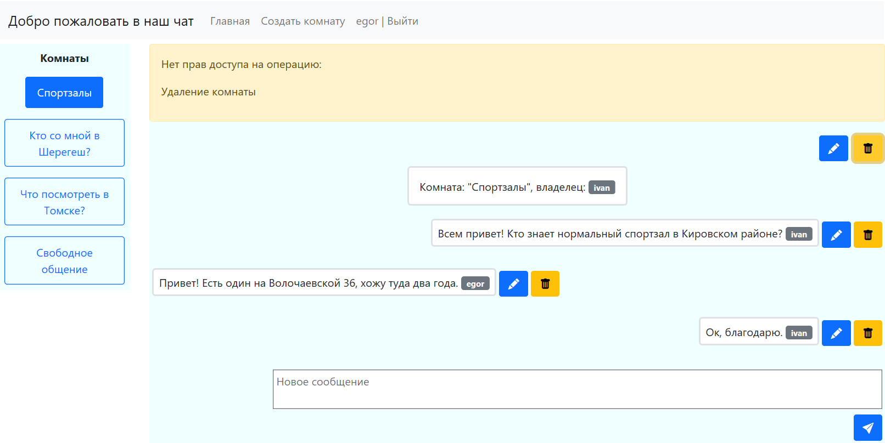
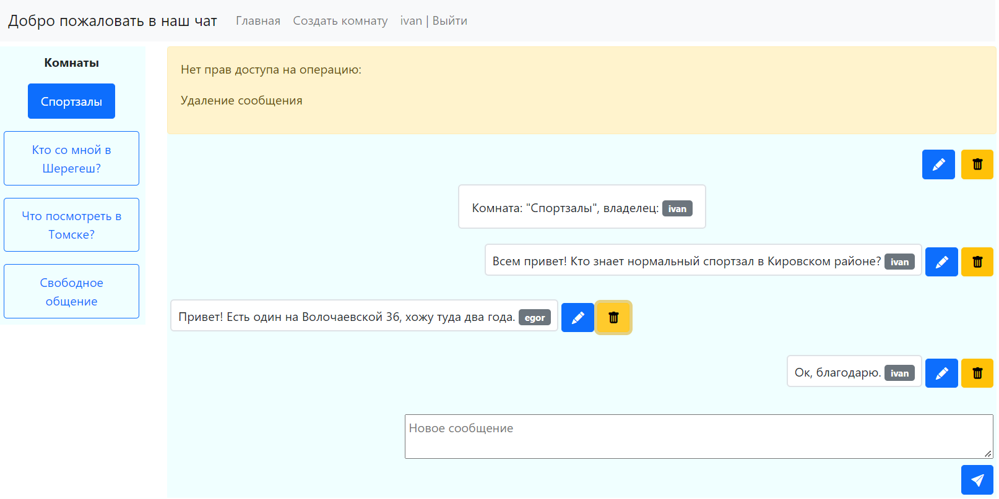

# job4j_chat
## О проекте

Чат с возможностью просмотра комнат анонимными пользователями.

Зарегистрированные пользователи могут создавать/редактировать свои комнаты и сообщения.

Front-end - чистый javascript, backend - Spring Boot, аутентификация/авторизация - JWT, Spring Security.

Взаимодействие между front-end и back-end - REST API.

##
## Как использовать
### API комнат
| Операция | Метод запроса | Содержание запроса | Статус ответа | Содержание ответа |
|--|--|--|--|--|
| Создание комнаты | POST | **Url**: '/room', **Body**: '{"name" : "room name", "owner" : "user"}' | CREATED | **Body**:  {"id": 11,"name": "room name","owner": "user","messages": null } |
| Редактирование комнаты | PATCH | **Url**: '/room', **Body**: '{"id" : "11", name : "test room"}' | OK | |
| Удаление комнаты | DELETE | **Url**: '/room/12' | OK | |
| Список всех комнат | GET | **Url**: '/room/' | OK | **Body**: [{"id": 12,"name": "room one"}, {"id": 13,"name": "room two"}] |
| Комната по ее id | GET | **Url**: '/room/12' | OK | **Body**: {"id": 13,"name": "444","owner": "user","messages": [{"id": 18,"content": "Hi","author": "test"}, {"id": 17,"content": "Hello","author": "user"}]}|

### API сообщений
| Операция | Метод запроса | Содержание запроса | Статус ответа | Содержание ответа |
|--|--|--|--|--|
| Создание сообщения | POST | **Url**: '/message/12', **Body**: '{"content" : "some text"}' | CREATED | |
| Редактирование комнаты | PATCH | **Url**: '/message/43', **Body**: '{"content" : "new text"}' | OK | |
| Удаление комнаты | DELETE | **Url**: '/message/43' | OK | |

### Внешний вид

Главная страница.

Создание комнаты.

Просмотр комнаты анонимным пользователем.

Ошибка удаления сообщения пользователем, не являющимся администратором или владельцем комнаты.

Переименование комнаты.

Ошибка удаления сообщения пользователем, не являющимся администратором или автором сообщения.

Страница регистрации.

Страница входа после успешной регистрации.

## Настройка и сборка
### Монолитное приложение

Настройки приложения содержатся в файле /src/main/resources/application.properties.

Сборка приложения осуществляется командой: mvn install.

Перед запуском приложения следует создать базу данных и настроить ее в соответсвии с файлом application.properties.

### Микросервисное приложение

Приложение состоит из двух контейнеров: само приложение и база данных.

Для запуска приложения нужно:

1. Склонировать проект, перейти в папку проекта.

2. Собрать приложение командой: mvn install

3. Перенастроить параметры соединения с базой данных в файлах application.properties и docker-compose.yml.

4. Собрать образ приложения командой: docker build -t chat .

5. Запустить приложение командой: docker-compose up

## Контакты

Email: kostasc@mail.ru
Telegram: @rkostashchuk